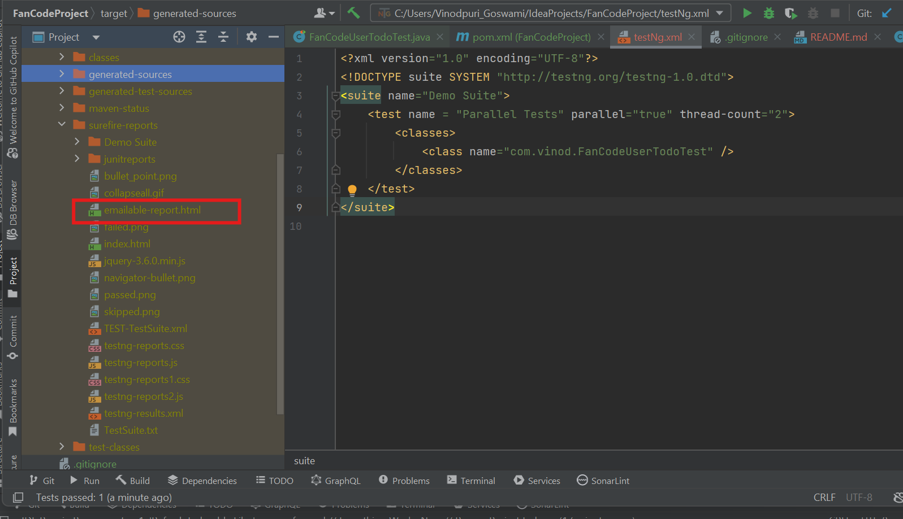

# API Automation Framework

## User Todo API Test with Java

This project uses Java, Maven, RestAssured, and TestNg to automate testing of APIs. The specific test scenario validates that all users from the city 'FanCode' have more than 50% of their todos tasks completed. This repository includes API testing examples using RestAssured and asserts conditions with JUnit.

## Getting Started

These instructions will get you a copy of the project up and running on your local machine for development and testing purposes.

### Prerequisites

What you need to install the software and how to install them:

1. **Java JDK 11+**
   - [Download Java](https://www.oracle.com/java/technologies/javase-jdk11-downloads.html)
   - Ensure Java JDK is set up properly with the `JAVA_HOME` environment variable.

2. **Maven**
   - [Download Maven](https://maven.apache.org/download.cgi)
   - Follow installation instructions here: [Maven installation guide](https://maven.apache.org/install.html)


### Steps to set up and run the project:

1. **Clone the Repository:**
   ```bash
    git clone https://github.com/VINOD-GOSWAMI/Todo_Api_Automation.git
   ```
2. **Navigate to the project directory:**
   ```bash
    cd 
   ```
3. **Run the tests using Maven:**
   ```bash
    mvn test
   ```
4. **After Running Test To View Execution Report:** 
  


Folder Structure
```tree

└───src
├───main
│   └───java
│       └───com
│           └───vinod
│               ├───api - Common Utility 
│               ├───model -DTO or Entity or Model Object 
│               └───service - Todo and User services Implmented
└───test
    └───java
         └───com
             └───vinod - Contains Test Cases
                  


